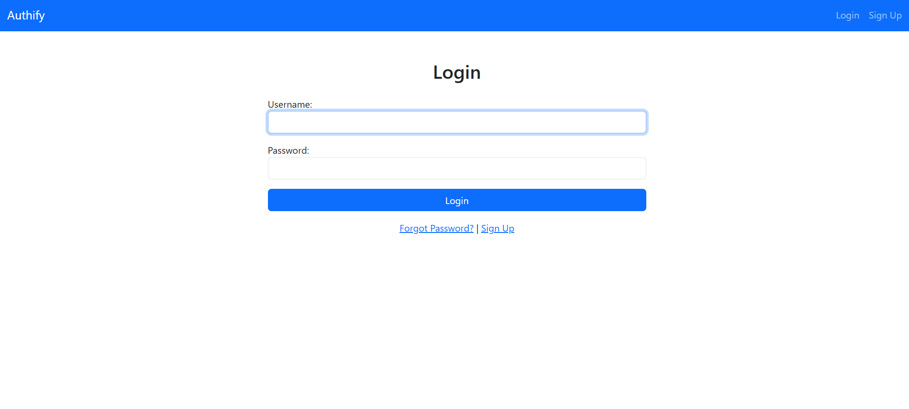
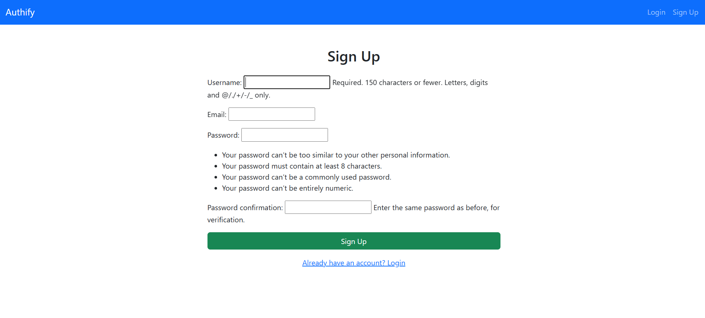
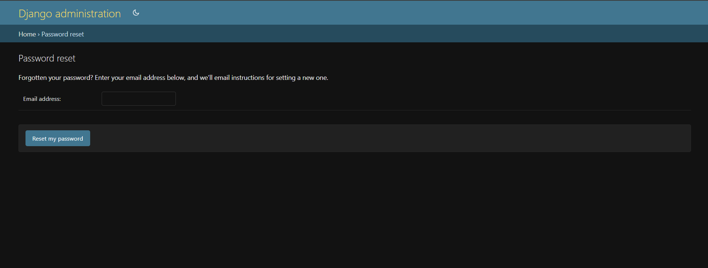
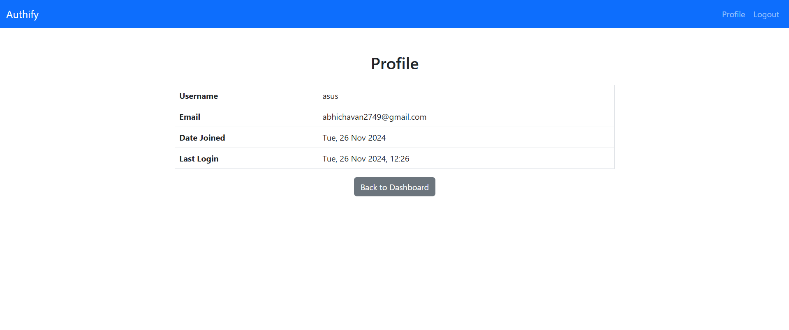

# Authify - Django Authentication App
A secure and modern Django-based authentication system with user registration, login, logout, password reset, change password, and user profile management.

## Features
- *User Authentication*: Login and Signup with email or username and password.
- *Forgot Password*: Allows users to reset their password via email.
- *Change Password*: Securely update passwords for authenticated users.
- *Dashboard*: Personalized dashboard for authenticated users.
- *User Profile*: Displays username, email, date joined, and last login information.
- *Access Restriction*: Ensures non-authenticated users cannot access sensitive pages.
- *Responsive Design*: Fully styled with Bootstrap for a professional look.

  ## Screenshots

### Login Page

### Sign-Up Page

### Forgot Password

### Dashboard

### Profile Page

## How to Run Locally
1. Clone the repository:
   bash
   git clone <repository-link>
2. Install Dependencies:
   bash
    pip install -r requirements.txt

4. Run Migrations:
   bash
   python manage.py migrate

5. Start the Development Server:
   bash
   python manage.py runserver

6. Access the app at "http://127.0.0.1:8000/".

## Technologies Used

- *Django*: Backend framework.
- *Bootstrap*: Frontend styling.
- *SQLite*: Database.
- *HTML/CSS*: Templates and styling.
- *Python*: Core language.

## Author
- *Your Name* - [dheeraj-chavan](https://github.com/dheeraj-chavan)